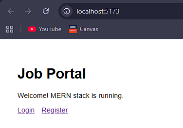
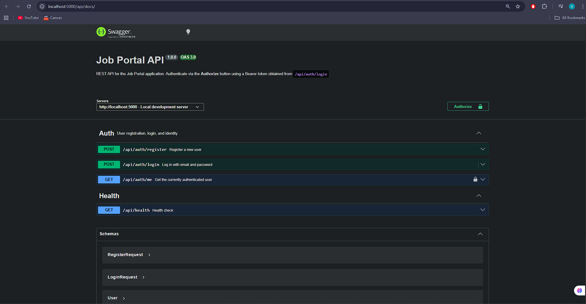
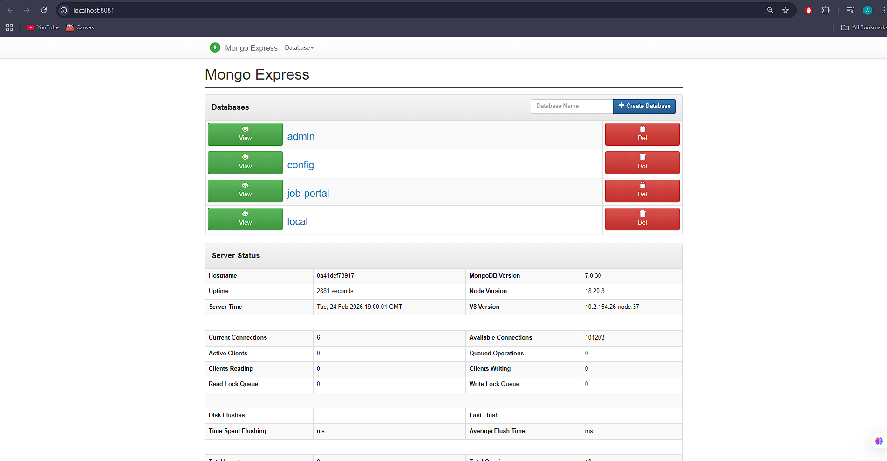

# Contributing to Job Portal

Welcome to Team 21's job portal project. This guide covers everything you need to get your development environment running, understand the workflow, and submit contributions.


## Table of Contents

- [Prerequisites](#prerequisites)
- [First-Time Setup](#first-time-setup)
- [Development Workflow](#development-workflow)
- [Project Services](#project-services)
- [Running Tests](#running-tests)
- [Code Quality](#code-quality)
- [Git Workflow](#git-workflow)
- [Environment Variables](#environment-variables)
- [Useful Commands](#useful-commands)


## Prerequisites

| Tool | Version | Notes |
|------|---------|-------|
| [Docker Desktop](https://www.docker.com/products/docker-desktop/) | Latest | Required — runs everything |
| [Git](https://git-scm.com/) | Any | For version control |
| [Node.js](https://nodejs.org/) | 20+ | Only needed for E2E tests and local linting outside Docker |

> All backend and frontend code runs inside Docker containers. You do not need Node.js installed locally to run the app.


## First-Time Setup

```bash
# 1. Clone the repository
git clone <repo-url>
cd job-portal

# 2. Create your local environment file
cp .env.example .env
```

Open `.env` and set a unique `JWT_SECRET`:

```bash
# Generate a random secret (requires Node.js locally) or use online random generator
node -e "console.log(require('crypto').randomBytes(64).toString('hex'))"
```

All other default variable in `.env` work out of the box for local development.

```bash
# 3. Build images and start all services
make up-d
```


## Development Workflow

### Starting and stopping

```bash
# note: Makefile contains abstraction of commonly used commands. 
# See Makefile for all commands
make up-d       # build images and start in background
make down       # stop containers (data preserved)
make down-v     # stop containers and wipe MongoDB data
make restart    # down + up-d
```

### Watching logs

```bash
make logs            # all services
make logs-backend    # backend only
make logs-frontend   # frontend only
```

### Hot reload

Both services support hot reload - file changes are reflected immediately without restarting containers:

| Service  | Mechanism |
|----------|-----------|
| Backend  | nodemon watches `backend/` |
| Frontend | Vite HMR watches `frontend/src/` |

### Opening a shell

```bash
make shell-backend   # sh inside the backend container
make shell-frontend  # sh inside the frontend container
make shell-mongo     # mongosh inside the MongoDB container
```


## Project Services

| Service       | URL                          | Credentials       | Visual                                                                   |
|---------------|------------------------------|-------------------|------------------------------------------------|
| Frontend      | http://localhost:5173        | —                 | |
| Backend API   | http://localhost:5000/api    | —                 |                                                                          |
| Swagger UI    | http://localhost:5000/api/docs | —               |       |
| Mongo Express | http://localhost:8081        | admin / admin     | |
| MongoDB       | localhost:27017              | root / example    |                                                                          |

### API Documentation (Swagger)

Interactive API docs are available at **http://localhost:5000/api/docs** while the stack is running.

To test protected endpoints directly in the browser:
1. Call `POST /api/auth/login` from the Swagger UI and copy the returned `token`
2. Click the **Authorize** button (top right of the page)
3. Enter `<your-token>` (without the word "Bearer") and click **Authorize**
4. All subsequent requests in the UI will include the token automatically

The raw OpenAPI JSON spec is also available at `http://localhost:5000/api/docs.json`.

### API Endpoints

| Method | Endpoint             | Auth   | Description       |
|--------|----------------------|--------|-------------------|
| GET    | /api/health          | Public | Health check      |
| GET    | /api/docs            | Public | Swagger UI        |
| POST   | /api/auth/register   | Public | Register new user |
| POST   | /api/auth/login      | Public | Login             |
| GET    | /api/auth/me         | Bearer | Current user info |


## Running Tests

### Unit and integration tests

Unit tests run locally without Docker — all dependencies are installed in `backend/node_modules` and `frontend/node_modules`.

```bash
# Run directly (fastest, no Docker needed)
cd backend && npm test
cd frontend && npm test

# Watch mode (re-runs on file save)
cd backend && npm run test:watch
cd frontend && npm run test:watch

# With coverage report
cd backend && npm run test:coverage
cd frontend && npm run test:coverage
```

Alternatively, run via Make (requires the stack to be running with `make up-d`):

```bash
make test             # backend + frontend via docker compose exec
make test-backend     # backend only
make test-frontend    # frontend only
make test-coverage    # both with coverage
```

> **Note:** The backend test setup (`backend/src/__tests__/setup.js`) automatically sets `JWT_SECRET` and `JWT_EXPIRES_IN` for the test process. No `.env` file is required to run tests locally.

### E2E tests (Playwright)

Install Playwright once (requires Node.js locally):

```bash
cd e2e
npm install
npx playwright install chromium
```

Then, with the stack running (`make up-d`):

```bash
make e2e              # run headless
make e2e-headed       # run with browser visible
```

Or let Make handle the full lifecycle:

```bash
make e2e-up           # starts stack → runs e2e → tears down
```

View the HTML report after a run:

```bash
make e2e-report
```

### Test structure

```
backend/src/__tests__/
  setup.js          # MongoMemoryServer lifecycle + test env vars
  health.test.js    # GET /api/health
  auth.test.js      # register, login, getMe + edge cases (15 tests)

frontend/src/__tests__/
  App.test.jsx      # component rendering and navigation (6 tests)

e2e/tests/
  auth.spec.js      # full-stack navigation flows (6 tests)
```

When adding new backend routes, add corresponding tests in `backend/src/__tests__/`.
When adding new React components, add tests in `frontend/src/__tests__/`.


## Code Quality

### Linting and formatting

```bash
make lint     # ESLint on backend + frontend (via docker compose exec)
make format   # Prettier on backend + frontend
```

Or run inside a specific container:

```bash
docker compose exec backend npm run lint:fix
docker compose exec frontend npm run lint:fix
```

### Style rules

Both packages share the same Prettier config:

```json
{ "semi": true, "singleQuote": true, "tabWidth": 2, "trailingComma": "es5", "printWidth": 100 }
```


## Git Workflow

### Branch naming

```
feature/<short-description>    # new feature
fix/<short-description>        # bug fix
chore/<short-description>      # tooling, config, deps
```

### Commit messages

Use the imperative mood, present tense, and keep the subject line under 72 characters e.g.

```
Add job listing model and CRUD routes
Fix JWT expiry not being read from env
Update Docker base image to node:20-alpine
Remove unused cors whitelist variable
```

Avoid vague messages like `fix bug`, `update stuff`, or `WIP`.

### Pull requests

1. Branch off `main`
2. Keep PRs focused — one feature or fix per PR
3. Ensure `make lint` and `make test` pass locally before opening a PR
4. CI runs automatically on every push — all three jobs (lint, test, e2e) must be green before merging
5. Request a review from at least one other team member


## Environment Variables

| Variable                   | Default                              | Description                       |
|----------------------------|--------------------------------------|-----------------------------------|
| `MONGO_URI`                | `mongodb://...@mongodb:27017/...`    | MongoDB connection string         |
| `MONGO_ROOT_USERNAME`      | `root`                               | MongoDB root username             |
| `MONGO_ROOT_PASSWORD`      | `example`                            | MongoDB root password             |
| `JWT_SECRET`               | *(must be set)*                      | JWT signing secret — keep private |
| `JWT_EXPIRES_IN`           | `7d`                                 | Token expiry duration             |
| `NODE_ENV`                 | `development`                        | Runtime environment               |
| `PORT`                     | `5000`                               | Backend port                      |
| `ME_CONFIG_BASICAUTH_USERNAME` | `admin`                          | Mongo Express login               |
| `ME_CONFIG_BASICAUTH_PASSWORD` | `admin`                          | Mongo Express password            |

**Rules:**
- Never commit `.env` — it is gitignored
- Each developer generates their own `JWT_SECRET` locally
- Shared staging/production secrets are stored in the deployment system, not in any file


## Useful Commands

```bash
make help           # list every Make target with descriptions
make build          # rebuild images without starting
make ps             # show container status
```

For raw Docker Compose commands when Make targets aren't enough:

```bash
docker compose up --build <service>    # rebuild a single service
docker compose logs -f <service>       # stream one service's logs
docker compose exec <service> sh       # open a shell anywhere
```
